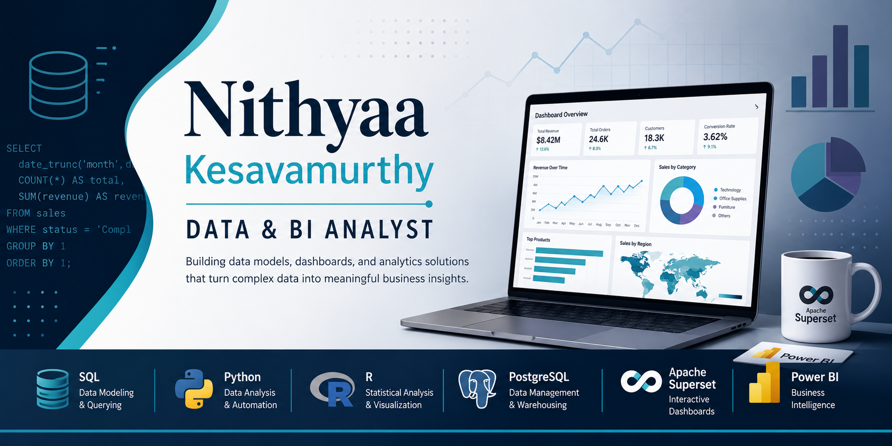

--------------------------------------------------

  

# Hi,  I'm Nithyaa 👋

### Data & BI Analyst — turning complex datasets into dashboards, data models, and reports that drive decisions.

I work across the analytics stack — modeling data in SQL, analyzing it in Python and R, and building interactive dashboards in **Apache Superset** and **Power BI**. My background in SQL and Oracle database engineering gives me a data-architecture foundation that shapes how I approach analytics. 

🎓 MS Candidate in Data Analytics Engineering @ Northeastern University

🌐 Portfolio:
https://nithyaak7.github.io/Data-Analyst-Portfolio

📫 LinkedIn:
https://www.linkedin.com/in/nithyaa-k/

Resume:
(https://github.com/nithyaak7/nithyaak7/blob/main/asset/Nithyaa_Kesavamurthy_Resume.pdf)

----------------------------------

## Tech Stack

SQL • Python • R • PostgreSQL • Apache Superset • Power BI • Excel

------------------------------------

## Featured Projects

- Recruitment Analytics Dashboard
- Insurance Churn Analytics
- EV Specs Analysis
- Walmart Sales Dashboard
- Google Play Store Analysis
---------------------------------
